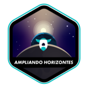
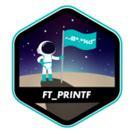

# Hi 👋, my name is ✨ Natasha ✨

I'm a Software Engineering, graduated in Digital Gaming Technology and studied at [école 42](https://www.42.fr) [São Paulo](https://www.42sp.org.br).
- 🖥 I’m currently working on [Digesto](https://www.digesto.com.br/);
- 💖 My favorite project is [Cub3D](https://github.com/natflausino/cub3D), raycaster with miniLibX programm project;
- 📚 I’m currently learning Python, HTML, JavaScript, CSS C, C# and Shell, and I started learning a little about React, Angular and Docker.
- 🎮 I love play games, read books and I have created some games. You can see and play them [here](https://natflausino.itch.io)

---
## 💻 42 Projects 💻

